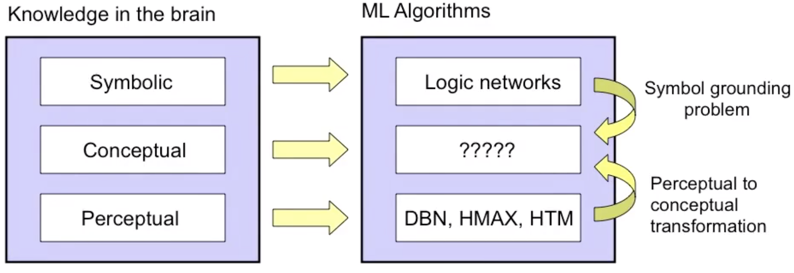

# Language and The World
 

Nowadays Deep Learning models (such as Bert) have largely promoted the development of Natural Language Processing. The main idea is to learn language model from large corpus. Despite the great success on many different NLP tasks, such as QA, deep learning models still fail to really **understand** human language. The thought experiment ["Chinese Room"](https://en.wikipedia.org/wiki/Chinese_room) tells why.
 

In my opinion, people learn language by understanding the world. In human's mind, we have a model for language, and also a model for the physical and mental world. Just as the introduction of Knowledge Graph from Google:

>"things not strings".

Generally speaking, learning a language is equivalent to developing a understanding of the world. **Grounding** symbols into real world objects is a prerequisite for natural language understanding, which is a step towards human-level intelligence or say AGI. Therefore I put some resources related to natural language grounding and understanding in this repo for your reference.

*Key words*: Symbolic Grounding,  World Model,  Natural Language Grounding, Embodied Learning, Cognitive Linguistic 

## Papers:
### Language Grounding in Virtual World
* [**Why Build an Assistant in Minecraft?**](https://research.fb.com/publications/why-build-an-assistant-in-minecraft/)
* [**BabyAI: First Steps Towards Grounding Language Learning With A Human In The Loop**](https://arxiv.org/pdf/1810.08272.pdf)
* [**A Computational Theory of Grounding in Natural Language Conversation**](https://apps.dtic.mil/dtic/tr/fulltext/u2/a289894.pdf)
* [**Extending Machine Language Models toward Human-Level Language Understanding**](https://arxiv.org/pdf/1912.05877.pdf)

### Visual Question Answering / Multimodal ML
* [**Grounded Semantic Role Labeling**](https://www.aclweb.org/anthology/N16-1019.pdf)
* [**Neural-Symbolic VQA: Disentangling Reasoning from Vision and Language Understanding**]()
* [**TVQA+: Spatio-Temporal Grounding for Video Question Answering**](https://arxiv.org/pdf/1904.11574.pdf)
* [**Visual Genome**](https://visualgenome.org)

### Neural-Symbolic Methods
* [**Towards Deep Symbolic Reinforcement Learning**](https://arxiv.org/pdf/1609.05518.pdf)

### Compositional and disentangled representations
* [**Reconciling deep learning with symbolic artificial intelligence: representing objects and relations**](https://www.sciencedirect.com/science/article/pii/S2352154618301943)
* [**β-VAE: LEARNING BASIC VISUAL CONCEPTS WITH A CONSTRAINED VARIATIONAL FRAMEWORK**](https://pdfs.semanticscholar.org/a902/26c41b79f8b06007609f39f82757073641e2.pdf)

### Cognitive Science
* [**THE SYMBOL GROUNDING PROBLEM**](https://eprints.soton.ac.uk/250382/1/symgro.pdf)
* [**Modularity of Mind**](https://plato.stanford.edu/entries/modularity-mind/#WhatMentModu)
* [**Is the mind really modular?**](http://www.subcortex.com/PrinzModularity.pdf)
* [**Building Machines That Learn and Think Like People**](https://arxiv.org/pdf/1604.00289.pdf)

## Courses:
* [**Language Grounding to Vision and Control**](https://katefvision.github.io/LanguageGrounding/#readings)
* [**Grounded Natural Language Processing**](https://www.cs.utexas.edu/~mooney/gnlp/)
* [**Grounded Language for Robotics**](http://www.cs.unc.edu/~mbansal/teaching/robonlp-seminar-spring17.html) 
* [**乔治·莱考夫认知语言学十讲**](https://www.bilibili.com/video/av33658267/?spm_id_from=333.788.videocard.12)

## Books:
* **Metaphors We Live by**

## Workshops:
* [**Vision Meets Cognition**](https://www.visionmeetscognition.org)
* [**Continual learning Workshop**](https://sites.google.com/view/continual2018/home)

## Web:
* [**Neureality**](https://neu-reality.com)
* [**Yann LeCun - How does the brain learn so much so quickly?**](https://www.youtube.com/watch?v=cWzi38-vDbE)
* [**What is wrong with convolutional neural nets**](https://www.youtube.com/watch?v=rTawFwUvnLE)
* [**构建AGI的系统神经科学方法 Demis Hassabis**](https://www.bilibili.com/video/av67433567/)

## Tutorial:
* [**ICML 2019 Causality**](https://slideslive.com/38917403/causal-inference-and-stable-learning)
* [**FROM SYSTEM 1 DEEP LEARNING TO SYSTEM 2 DEEP LEARNING**](https://www.youtube.com/watch?v=FtUbMG3rlFs)

## Tasks:
* [**Continual Learning and Object Recognition, Detection, Segmentation**](https://vlomonaco.github.io/core50/)

## Active Researchers:
* [George Lakoff](https://georgelakoff.com) (UCB)
* [Mohit Bansal](http://www.cs.unc.edu/~mbansal/prospective-students.html) (UNC)
* [Igor Labutov](https://igorlabutov.com) (LAER AI) 
* [Bishan Yang](http://www.cs.cmu.edu/~bishan/) (LAER AI)
* [Yoshua Bengio](https://mila.quebec/en/yoshua-bengio/) (MILA)
* [Joyce Y. Chai](http://www.cse.msu.edu/~jchai/) (Umich)
* [David Traum](http://people.ict.usc.edu/~traum/)(USC)
* [Raymond J. Mooney](https://www.cs.utexas.edu/users/mooney/)(UTA)
* [Yonatan Bisk](https://yonatanbisk.com)(CMU)
* [Marta Garnelo](https://www.martagarnelo.com)(DeepMind)
* [Mark B. Ring](https://www.cs.utexas.edu/~ring/)
* [Jiayuan Mao](http://jiayuanm.com)

